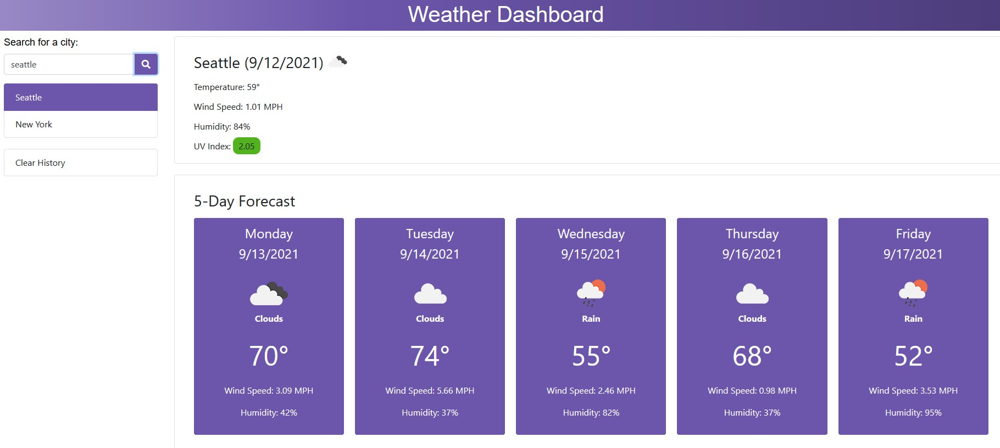

# Weather Dashboard

## Purpose
A web application that allows users to search for a city and retrieve its 5-day weather forecast using the OpenWeather API.  Cities that users had previously looked up will be saved in the browser's local storage.

## Website
https://tw2159.github.io/weather-dashboard/

## Built With
* HTML
* CSS
* Bootstrap
* JavaScript
* jQuery
* OpenWeather API

## Contribution
Made with ❤️ by Te Wei